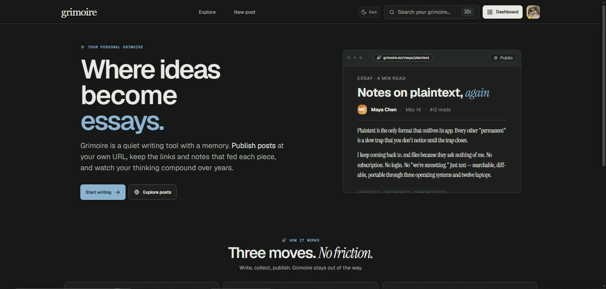
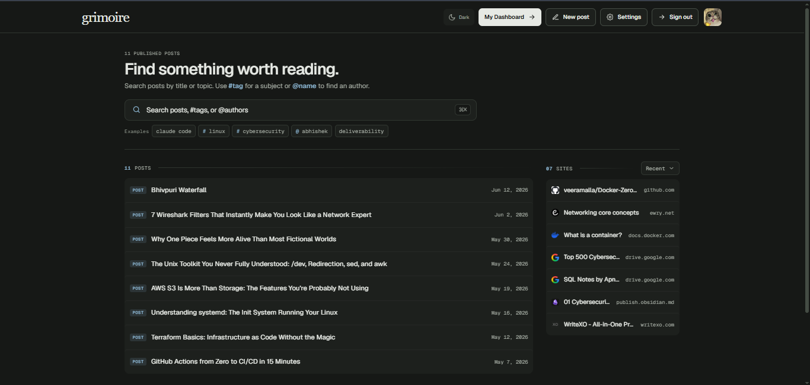
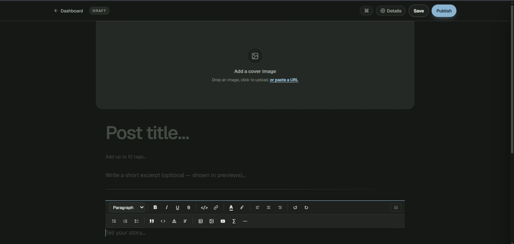
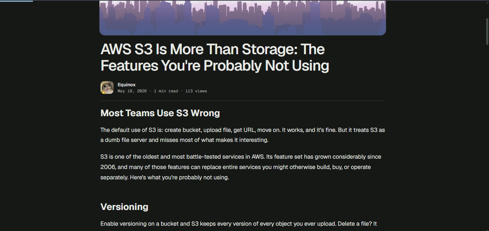
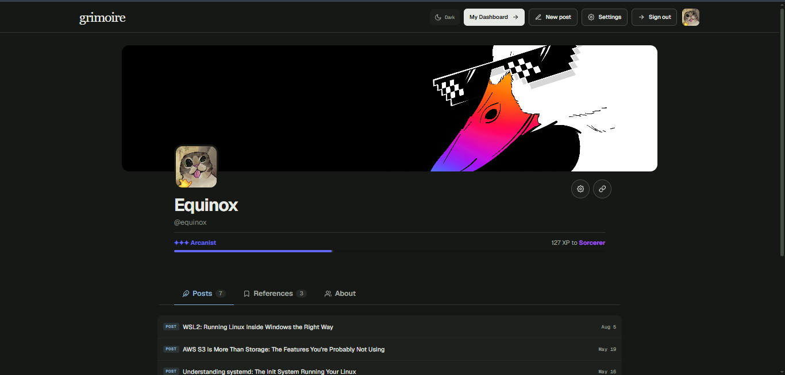

# Grimoire

Grimoire is a quiet, durable publishing space for people who write, read, and keep the links that shaped their thinking. It combines a long-form blog, a personal archive of bookmarks, and a focused writing environment without treating knowledge like a noisy productivity dashboard.

> **Project status:** self-hosted application under active development.

## Screenshots

Add screenshots to `docs/images/` and replace these placeholders when ready:

## What it includes

- Public profiles and published long-form posts
- Private drafts and public/private bookmark visibility
- Focused editor with rich text, code blocks, syntax highlighting, mathematics, tables, images, links, tasks, and embeds
- Explore feed, search, tags, featured posts, RSS, and public user discovery
- Comments, authenticated likes, and authenticated comment votes
- Profile avatar/banner editing with image cropping
- GIF and bundled sticker support
- Account settings, email verification, password reset, optional 2FA, and optional Google OAuth configuration
- Light and dark themes with a persistent browser preference
- Database-backed media so uploaded images are included in database backups

## Architecture

    Browser
      └── Next.js / React frontend :3000
            └── Flask API / Gunicorn :5051
                  └── MariaDB 11 (Docker volume: mariadb_data)

### Stack

**Frontend:** Next.js 16.2.6, React 19.2.4, TypeScript 5, Tiptap, lowlight, DOMPurify, KaTeX, Tailwind/PostCSS.

**Backend:** Python 3.9, Flask 3, Gunicorn, PyJWT, bcrypt, Authlib, Flask-CORS, Flask-Limiter, Requests, BeautifulSoup/lxml, nh3.

**Database:** MariaDB 11 with UTF-8 `utf8mb4` tables.

**Deployment:** Docker Compose. The original frontend is the default service. An alternative local frontend can be run separately when available, but both frontends cannot use host port 3000 at the same time.

## Repository layout

    api/                 Flask API, blueprints, schemas, migrations
    frontend/             Main Next.js application
    ops/                  Backup/log rotation scripts and migration notes
    docker-compose.example.yml  Safe Compose template without live secrets
    PRODUCT.md            Product goals and design principles

Private deployment files such as `api/config/.env`, local `docker-compose.yml`, database archives, and operator notes are intentionally excluded from Git.

## Local development and Docker

Copy the example environment file and fill in local values:

    cp api/config/.env.example api/config/.env

Start the application:

    docker compose up -d mariadb backend frontend

Open `http://localhost:3000` for the frontend. The API is available at `http://localhost:5051`.

View service state and logs:

    docker compose ps
    docker logs -f grimoire-backend
    docker logs -f grimoire-db

Rebuild after source or dependency changes:

    docker compose build backend frontend
    docker compose up -d --force-recreate backend frontend

Stop without deleting database data:

    docker compose stop

Remove containers while preserving the named database volume:

    docker compose down

> Do not use `docker compose down -v` unless you intentionally want to delete the MariaDB volume and all database data.

## Media persistence

Uploaded avatars, banners, post covers, and inline uploaded images are stored as bytes in the MariaDB `media_assets` table. They are served through `/api/media/<asset-id>`.

This avoids the container-filesystem failure where an image path remains in the database but the actual file disappears after rebuilding or migrating a container. Normal SQL dumps include the media bytes.

## Security model

- Passwords are hashed with bcrypt.
- Login tokens are signed JWTs with an expiry.
- Protected mutations require an authenticated account and ownership checks.
- Anonymous comments, likes, and comment votes are disabled.
- Rate limits protect login, registration, OTP, password reset, comments, votes, likes, and GIF requests.
- Browser state-changing requests use allowed-origin checks.
- CORS, CSP, HSTS, clickjacking, MIME-sniffing, and referrer protections are configured.
- Metadata fetching validates DNS/IP targets and redirects to reduce SSRF risk.
- User content is sanitized before rendering.

No application can be guaranteed completely unhackable. Keep the host, Docker images, Python packages, npm packages, database, and reverse proxy patched. Never commit `.env` files or expose MariaDB publicly.

## Database backup and migration

Create a compressed dump containing the complete database and uploaded media:

    docker exec grimoire-db sh -lc 'mariadb-dump -u"$MYSQL_USER" -p"$MYSQL_PASSWORD" "$MYSQL_DATABASE" --single-transaction --routines --events' | gzip > linkvault-$(date -u +%F-%H%M).sql.gz

On a new server, start MariaDB and restore:

    docker compose up -d mariadb
    gunzip -c linkvault-YYYY-MM-DD-HHMM.sql.gz | docker exec -i grimoire-db sh -lc 'mariadb -u"$MYSQL_USER" -p"$MYSQL_PASSWORD" "$MYSQL_DATABASE"'
    docker compose up -d backend frontend

Keep the matching environment configuration and application source with the dump. Do not depend on the old `static/uploads` directory.

Detailed migration and operations instructions are in [`ops/README.md`](ops/README.md). The private credential-bearing operator guide is kept locally at `private/GRIMOIRE_PROJECT_OPERATIONS_GUIDE.md` and is not part of this repository.

## Rolling backups and logs

The script [`ops/rotate-grimoire-archives.sh`](ops/rotate-grimoire-archives.sh) creates a daily database dump and the previous 24 hours of Docker logs. It keeps three days under:

    /opt/grimoire2/runtime/archives/YYYY-MM-DD/

Installation is a one-time host operation; Git does not install cron automatically:

    sudo install -m 644 ops/grimoire-archive.cron /etc/cron.d/grimoire-archive
    sudo systemctl enable --now cron       # Ubuntu/Debian

Run a test manually:

    sudo ops/rotate-grimoire-archives.sh
    tail -100 /opt/grimoire2/runtime/archive-cron.log

## Contributing and Git hygiene

Before committing:

    git status --short
    git diff --check
    python3 -m compileall -q api
    docker compose config

Never commit `api/config/.env`, local `docker-compose.yml`, database dumps, `runtime/`, private operator documentation, or any passwords/API keys.

Commit and push tracked changes:

    git add .gitignore api frontend ops docker-compose.example.yml PRODUCT.md
    git diff --cached --name-only
    git commit -m "Describe the change"
    git push origin main

If the remote branch contains commits first, synchronize before pushing:

    git fetch origin
    git pull --rebase origin main
    git push origin main

## Design principles

Grimoire favors quiet interfaces, readable long-form content, progressive disclosure, durable data, privacy by default, and accessible contrast. The interface should recede so the writing and knowledge remain the focus.
